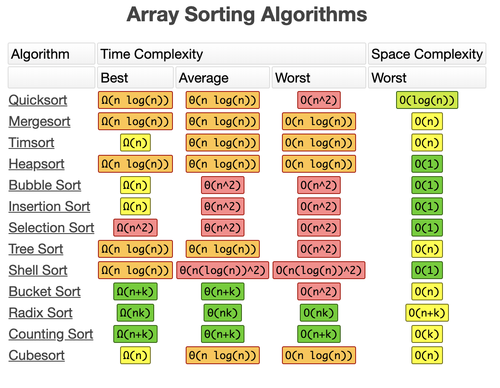
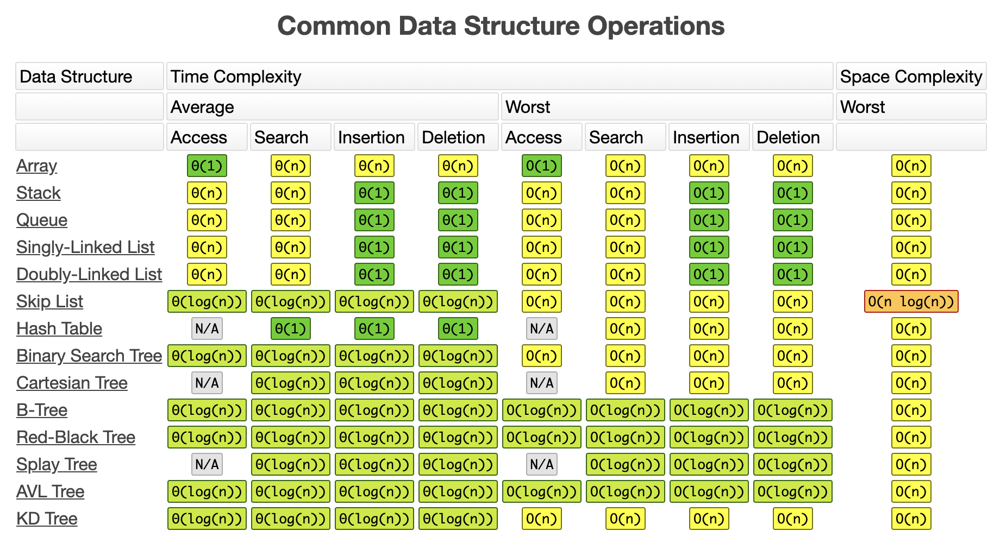

# leetcode

记录个人刷leetcode的题解

#### 复杂度

* 时间复杂度：算法的执行时间与[数据规模]之间的增长关系
* 空间复杂度：算法的存储空间与[数据规模]之间的增长关系



#### 题型

* 矩阵
* 二叉树
  * 红黑树
* LRU
* 排序
* 链表

#### 答题细节

1、反复审题
2、与面试官交流确认细节
3、编写代码记得书写规范，例如 () {}前后添加空格。
最后，写上测试用例

#### 四件套

1、跟面试官把题目都确认无误
2、尽可能想所有的解题方法，并比较它们的时间复杂度和空间复杂度。
3、然后选择用时最少，空间使用较少的解法答题。
4、书写测试用例。

#### 练习步骤

1、5-10分钟：读题和思考
2、有思路：自己开始做和写代码。否则，直接看题解。
3、默写背诵、熟练。上国际站看更优代码，部分冗余题解直接忽略
4、然后开始自己写（闭卷）
最大误区：刷题只刷一遍

#### 递归

> 主定理：用于计算所有递归的时间复杂度，记住常见四种算法的时间复杂度即可。

1、Binary search，二分查找。O(logn)
> 在有序的数组中查找，一分为二，每次只查找一边。
2、Binary tree traversal，二叉搜索树。O(n)
> 二叉树的遍历 ，每个节点都会访问一遍且只会访问一遍，所以时间复杂度线性于节点数。同理深度优先（前中后序遍历）、广度优先搜索的时间复杂度也是O(n)
3、Optimal sorted matrix search，最优排序矩阵搜索。O(n)
> 在已排序的矩阵中进行二分查找
4、Merge sort，归并排序。O(nlogn)
> 所有排序算法，最优复杂度为O(nlogn)

##### 红黑树(近似平衡二叉树)

> map、set实现用红黑树，构建红黑树相对AVL更加容易些
> 能够保证任何一个节点的左右子树的高度差小于俩倍
比如左子树高度2，那右子树高度范围可以为 1 - 4
下面的条件用于保证高度差小于俩倍

* 每个节点是红色或黑色
* 根节点和叶节点（NIL）是黑色（头跟尾都是黑色）
* 不能有个相邻的红色节点
* 任何节点到每个叶子的所有路径包含相同数目的黑色节点

### 递归

> 写递归代码的关键就是找到如何将大问题分解为小问题的规律，并且基于此写出递推公式，然后再推敲终止条件，最后将递推公式和终止条件翻译成代码

* 满足三个条件
  * 一个问题的解可以分解为几个子问题的解
  * 这个问题与分解之后的子问题，除了数据规模不同，求解思路完全一样
  * 存在递归终止条件
* 递归终结条件
* 当前层逻辑
* 进入下一层
* 如有需要，清利当前层状态

* 注意事项
  * 不要人肉递归
  * 找重复子问题
  * 数学归纳法
        当1，2时成立，n成立，推断出n+1也成立
  * 深度比较小时，可以通过限制深度避免栈溢出
  * 自动检测“环”的存在，避免栈溢出（检测环可以构造一个set集合或者散列表。每次获取到上层推荐人就去散列表里先查，没有查到的话就加入，如果存在则表示存在环了。每一次查询都是一个自己的散列表，不能共用。）

* 调试递归
  不要被每一步的细节所困，重点在于确认递推关系与结束条件是否正确，用条件断点着重调试最初两步与最终两步即可。

### dfs\bfs

* 每个节点只访问一次
* bfs，队列

### 贪心算法

> 证明题目可以使用贪心法

* 每次选择当前最优解
* 无法回退
* 有点鼠目寸光，有局限性

### 二分查找

* 单调性：递增递减
* 存在上下界：存在边界
* 能够通过索引访问

### 动态规划

* 分治
* 最优子结构，中途淘汰次优解

### 布隆过滤器

* 类似于hash表，用一个哈希函数处理后，用二进制表示元素是否存在。
* 新加入的元素，判断不存在则一定没有，判断存在时，只能说可能存在。
* 应用：分布式系统，在查询前做一次判断，假设不存在就没必要访问数据库。

### LRU-cache(least recent used,最近最少使用)

### LFU-cache(least frequently used,最近使用频次最少)

### 排序

* 基数排序

#### 重点

* 堆排序
* 计数排序
  * 计数排序其实是桶排序的一种特殊情况。所处的范围并不大的时候，比如最大值是 k，我们就可以把数据划分成 k 个桶。
* 快速排序
* 归并排序

#### 简单排序O(n^2)

* 选择排序：每次找最小值，放到待排序数组的前面
* 插入排序：假设前面已经排序，将后续的元素逐个插入前面已排序数组中
* 冒泡排序：每次查看相邻元素是否逆序，是则交换

#### 线性排序

### 面试高频题

一亿条数据中选出1000个最大的（排序相关）
一个很大数据中，统计出现次数最多的前10个数据（hash计数后，堆排序）

ksum
一个阶乘，说先不考虑大数
蛇形输出一个非完全二叉树
lru算法；
类似传说中的手撕红黑树
合并排序俩个有序数组
二叉树找到求和得到sum的分叉
快拍 选择排序
手写冒泡排序
实现斐波那契数列
二分查找，时间复杂度和空间复杂度
手写二叉树的中序遍历

### 中序遍历二叉树非递归

```javascript
// 实现1
var inorderTraversal = function (root) {
  var [WHITE, GRAY] = [0, 1] // 1为访问过节点
  var res = []
  var stack = [[WHITE, root]]
  var node,color = null
  while(stack.length>0){
    [color, node] = stack.pop()
    if(!node) continue
    if(color == WHITE){
      stack.push([WHITE, node.right])
      stack.push([GRAY, node])
      stack.push([WHITE, node.left])
    }else{
      res.push(node.val)
    }
  }
  return res
}
// 实现2
var inorderTraversal = function (root) {
  const stack = []
  let init = true
  const res = []
  while(stack.length > 0 || init){
    while(root){
      stack.push(root)
      root = root.left
    }
    init = false
    root = stack.pop()
    res.push(root.val)
    root = root.right
  }
  return res
}
```

从数组中选n个树，和为sum，求时间空间复杂度
100w条数据如何排序（先计数排序，然后每个桶再快拍？）
二进制协议与文本协议的区别
webpack热加载原理
node如何处理并发，讲一下cluster
实现水平垂直居中，高度是宽度二分之一

### 大O符号中指定的算法的增长顺序


### 以下是一些最常用的 大O标记法 列表以及它们与不同大小输入数据的性能比较

| 大O标记法      | 计算10个元素                 | 计算100个元素                 | 计算1000个元素                  |
| -------------- | ---------------------------- | ----------------------------- | ------------------------------- |
| **O(1)**       | 1                            | 1                             | 1                               |
| **O(log N)**   | 3                            | 6                             | 9                               |
| **O(N)**       | 10                           | 100                           | 1000                            |
| **O(N log N)** | 30                           | 600                           | 9000                            |
| **O(N^2)**     | 100                          | 10000                         | 1000000                         |
| **O(2^N)**     | 1024                         | 1.26e+29                      | 1.07e+301                       |
| **O(N!)**      | 3628800                      | 9.3e+157                      | 4.02e+2567                      |

### 数据结构操作的复杂性

| 数据结构       |  连接  |  查找  |  插入  |  删除  | 备注 |
| -------------- | :----: | :----: | :----: | :----: | ---- |
| **数组**       |   1    |   n    |   n    |   n    |      |
| **栈**         |   n    |   n    |   1    |   1    |      |
| **队列**       |   n    |   n    |   1    |   1    |      |
| **链表**       |   n    |   n    |   1    |   1    |      |
| **哈希表**     |   -    |   n    |   n    |   n    | 在完全哈希函数情况下，复杂度是 O(1） |
| **二分查找树** |   n    |   n    |   n    |   n    | 在平衡树情况下，复杂度是 O(log(n)) |
| **B 树**       | log(n) | log(n) | log(n) | log(n) |      |
| **红黑树**     | log(n) | log(n) | log(n) | log(n) |      |
| **AVL 树**     | log(n) | log(n) | log(n) | log(n) |      |
| **布隆过滤器** |   -    |   1    |   1    | - | 存在一定概率的判断错误（误判成存在） |

### 数组排序算法的复杂性

| 名称                  | 最优      | 平均      | 最坏          | 内存      | 稳定      | 备注                  |
| --------------------- | :-------: | :-------: | :-----------: | :-------: | :-------: | --------------------- |
| **冒泡排序**          | n         | n^2       | n^2           | 1         | Yes       |                       |
| **插入排序**          | n         | n^2       | n^2           | 1         | Yes       |                       |
| **选择排序**          | n^2       | n^2       | n^2           | 1         | No        |                       |
| **堆排序**            | n log(n)  | n log(n)  | n log(n)      | 1         | No        |                       |
| **归并排序**          | n log(n)  | n log(n)  | n log(n)      | n         | Yes       |                       |
| **快速排序**          | n log(n)  | n log(n)  | n^2           | log(n)    | No        | 在 in-place 版本下，内存复杂度通常是 O(log(n)) |
| **希尔排序**          | n log(n)  | 取决于差距序列   | n (log(n))^2  | 1         | No        |  |
| **计数排序**          | n + r     | n + r     | n + r         | n + r     | Yes       | r - 数组里最大的数    |
| **基数排序**          | n *k     | n* k     | n * k         | n + k     | Yes       | k - 最长 key 的升序   |
