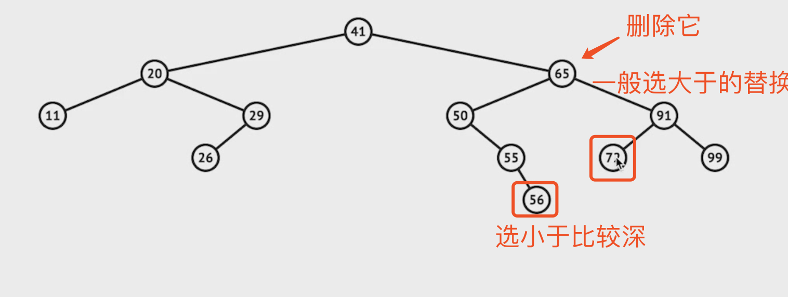

# leetcode
记录个人刷leetcode的题解
#### 复杂度
* 时间复杂度：算法的执行时间与[数据规模]之间的增长关系
* 空间复杂度：算法的存储空间与[数据规模]之间的增长关系


#### 题型
* 矩阵
* 二叉树
    * 红黑树
* LRU
* 排序
* 链表

#### 答题细节
1、反复审题
2、与面试官交流确认细节
3、编写代码记得书写规范，例如 () {}前后添加空格。
最后，写上测试用例

#### 四件套
1、跟面试官把题目都确认无误
2、尽可能想所有的解题方法，并比较它们的时间复杂度和空间复杂度。
3、然后选择用时最少，空间使用较少的解法答题。
4、书写测试用例。

#### 练习步骤
1、5-10分钟：读题和思考
2、有思路：自己开始做和写代码。否则，直接看题解。
3、默写背诵、熟练。上国际站看更优代码，部分冗余题解直接忽略
4、然后开始自己写（闭卷）
最大误区：刷题只刷一遍

#### 递归
> 主定理：用于计算所有递归的时间复杂度，记住常见四种算法的时间复杂度即可。

1、Binary search，二分查找。O(logn)
> 在有序的数组中查找，一分为二，每次只查找一边。
2、Binary tree traversal，二叉搜索树。O(n)
> 二叉树的遍历 ，每个结点都会访问一遍且只会访问一遍，所以时间复杂度线性于结点数。同理深度优先（前中后序遍历）、广度优先搜索的时间复杂度也是O(n)
3、Optimal sorted matrix search，最优排序矩阵搜索。O(n)
> 在已排序的矩阵中进行二分查找
4、Merge sort，归并排序。O(nlogn)
> 所有排序算法，最优复杂度为O(nlogn)

#### 栈
> 最近相关性
> 先来后到

#### 二叉树
> 遍历方法可以用递归或栈迭代法
> 树的解法一般使用递归
普通树查找节点就是所有的节点都遍历一遍：O（n）
前序遍历（preorder）：根左右
中序遍历（inorder）：左根右
后序遍历（postorder）：左右根
#### 二叉搜索树（有序二叉树、排序二叉树）
> 左子树所有节点小于根节点；右子树所有节点大于根节点 
> 对搜索树的中序遍历就是对它的升序遍历
* 查询、新增每次通过对比当前节点与查询/新增数值大小关系，小于则往左子树走，大于往右子树
* 删除
    * 叶子节点，直接删除即可
    * 根节点或中间节点：需要找到离删除节点较近的节点。一般选取第一个大于删除节点的节点（右子树的第一个左子节点）替换被删除节点。
    
#### 平衡二叉树
> 保证二维的平衡
##### AVL树
> 适合频繁读，写较少。更加平衡容易读取数据，但是构建操作繁琐
> 平衡因子（balance factor）：左子树高度减去右子树高度（可能相反）
factor = [-1,0,1]之间
> 所以高度差为0到1
> 通过旋转操作进行平衡
* 右右子树 -》 左旋
.[](./assets/AVL左旋.png)
* 左左子树 -》 右旋
.[](./assets/AVL右旋.png)
* 左右子树 -》 左右旋
.[](./assets/AVL左右旋.png)
* 右左子树 -》 右左旋
.[](./assets/AVL右左旋.png)
##### 红黑树(近似平衡二叉树)
> map、set实现用红黑树，构建红黑树相对AVL更加容易些
> 能够保证任何一个节点的左右子树的高度差小于俩倍
比如左子树高度2，那右子树高度范围可以为 1 - 4
下面的条件用于保证高度差小于俩倍
* 每个结点是红色或黑色
* 根结点和叶结点（NIL）是黑色（头跟尾都是黑色）
* 不能有个相邻的红色结点 
* 任何结点到每个叶子的所有路径包含相同数目的黑色结点
### 递归
* 递归终结条件
* 当前层逻辑
* 进入下一层
* 如有需要，清利当前层状态

* 注意事项
    * 不要人肉递归
    * 找重复子问题
    * 数学归纳法
        当1，2时成立，n成立，推断出n+1也成立

### dfs\bfs
* 每个节点只访问一次
* bfs，队列

### 贪心算法
> 证明题目可以使用贪心法
* 每次选择当前最优解
* 无法回退
* 有点鼠目寸光，有局限性

### 二分查找
* 单调性：递增递减
* 存在上下界：存在边界
* 能够通过索引访问 

### 动态规划
* 分治
* 最优子结构，中途淘汰次优解

### 布隆过滤器
* 类似于hash表，用一个哈希函数处理后，用二进制表示元素是否存在。
* 新加入的元素，判断不存在则一定没有，判断存在时，只能说可能存在。
* 应用：分布式系统，在查询前做一次判断，假设不存在就没必要访问数据库。

### LRU-cache(least recent used,最近最少使用)
### LFU-cache(least frequently used,最近使用频次最少)

### 排序
#### 重点
* 堆排序
* 快速排序
* 归并排序
#### 简单排序O(n^2)
* 选择排序：每次找最小值，放到待排序数组的前面
* 插入排序：假设前面已经排序，将后续的元素逐个插入前面已排序数组中
* 冒泡排序：每次查看相邻元素是否逆序，是则交换


### 面试高频题
一亿条数据中选出1000个最大的（排序相关）
一个很大数据中，统计出现次数最多的前10个数据（hash计数后，堆排序）


ksum
一个阶乘，说先不考虑大数
蛇形输出一个非完全二叉树
lru算法；
类似传说中的手撕红黑树
合并排序俩个有序数组
二叉树找到求和得到sum的分叉
快拍 选择排序 
手写冒泡排序
实现斐波那契数列
二分查找，时间复杂度和空间复杂度
手写二叉树的中序遍历

### 中序遍历二叉树非递归
```javascript
var inorderTraversal = function (root) {
    var [WHITE, GRAY] = [0, 1] // 1为访问过节点
    var res = []
    var stack = [[WHITE, root]]
    var node,color = null
    while(){
        [color, node] = stack.pop()
        if(!node) continue
        if(color == WHITE){
            stack.push([WHITE, node.right])
            stack.push([GRAY, node])
            stack.push([WHITE, node.left])
        }else{
            res.push(node.val)
        }
    }
    return
}
```
从数组中选n个树，和为sum，求时间空间复杂度
100w条数据如何排序（先计数排序，然后每个桶再快拍？）
二进制协议与文本协议的区别
webpack热加载原理
node如何处理并发，讲一下cluster
实现水平垂直居中，高度是宽度二分之一