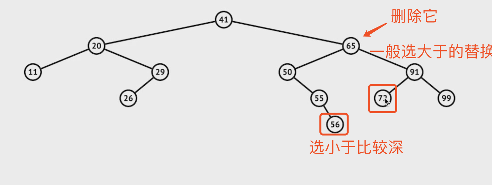

# 树

> 通过树问题，主要考察递归算法
> 普通树查找节点就是所有的节点都遍历一遍：O（n）

* 前序遍历（preorder）：根左右
  * 搜索树
  * 创建树
* 中序遍历（inorder）：左根右
  * 二叉搜索树（面试考察重点）
* 后序遍历（postorder）：左右根
  * 当对某节点分析时，需要用到左、右子树的信息时

## 二叉树

> 遍历方法可以用递归或栈迭代法
> 树的解法一般使用递归

## 平衡二叉树

> 保证二维的平衡

## 完全二叉树

## 二叉搜索树（有序二叉树、排序二叉树）

> 左子树所有节点小于根节点；右子树所有节点大于根节点
> 对搜索树的中序遍历就是对它的升序遍历

* 查询、新增每次通过对比当前节点与查询/新增数值大小关系，小于则往左子树走，大于往右子树
* 删除
  * 叶子节点，直接删除即可
  * 根节点或中间节点：需要找到离删除节点较近的节点。一般选取第一个大于删除节点的节点（右子树的第一个左子节点）替换被删除节点。
    
