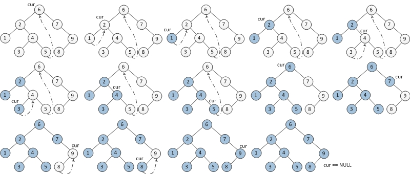

# 树的遍历（**在理解的基础上记忆**）

面试时见到二叉树的遍历，你不能再去想太多——没有那么多时间给你现场推理，这么熟悉的题目你没必要现场推理，你要做的是**默写！默写啊！老哥们！！**

* 前序遍历
* 中序遍历
* 后序遍历
* 层次遍历

## 前序遍历（preorder）：根左右

* 搜索树
* 创建树

### 递归前序遍历

```javascript
/*
* 时间复杂度O(N)
* 空间复杂度O（logN）坏O(N)
* 坏O(N)：树的节点都在一条直线上，每一层的递归状态 * N
*/
var preorderTraversal = function(root) {
  var result = []
  function preorder(node){
    if(!node) return

    result.push(node.val)
    preorder(node.left)
    preorder(node.right)
  }
  preorder(root)
  return result
}
```

### 栈迭代前序遍历

```javascript
/*
* 时间复杂度O(N)
* 空间复杂度O(H)
*/
var preorderTraversal = function(root) {
  // 定义枚举值，遇到GREEN表示访问过节点，以便输出节点
  const [WHITE, GREEN] = [0,1]  
  const result = []
  let color,node
  const stack = [[WHITE, root]]
  while(stack.length){
    [color,node] = stack.pop()
    if(!node) continue

    if(color == GREEN){
      result.push(node.val)
    }else{
      // 前序遍历：根左右，入栈：右左根
      stack.push([WHITE, node.right])
      stack.push([WHITE, node.left])
      stack.push([GREEN, node])
    }
  }
  return result
}
```

## 中序遍历（inorder）：左根右

* 二叉搜索树<font color=red>（面试考察重点）</font>

### 递归中序遍历

```javascript
/*
* 时间复杂度O(N)
* 空间复杂度O（logN）坏O(N)
*/
var inorderTraversal = function(root) {
  var result = []
  function inorder(node){
    if(!node) return

    inorder(node.left)
    result.push(node.val)
    inorder(node.right)
  }
  inorder(root)
  return result
}
```

### 栈迭代中序遍历

```javascript
/*
* 时间复杂度O(N)
* 空间复杂度O(H)
*/
var inorderTraversal = function(root) {
  const [WHITE,GREEN] = [0,1]
  const result = []
  const stack = [[WHITE,root]]
  let color,node = null
  while(stack.length){
    [color,node] = stack.pop()
    if(!node) continue

    if(color==GREEN){
      result.push(node.val)
    }else{
      // 因为node.right/left有可能为空，所以上述遇到空的node要跳过，直到栈空
      // 栈是先进后出，中序遍历：左根右，入栈为右根左
      stack.push([WHITE, node.right])
      stack.push([GREEN, node])
      stack.push([WHITE, node.left])
    }
  }
  return result
}
```

### 莫里斯中序遍历（morris inorder traversal）



```javascript
/*
* 过程：
* A、如果当前节点（cursor）的左孩子为空，则输出当前节点并将其右孩子作为当前节点。
* B、如果当前节点（cursor）的左孩子不为空，在当前节点的左子树中找到当前节点在中序遍历下的前驱节点。
   1) 如果前驱节点的右孩子为空，将它的右孩子设置为当前节点。当前节点更新为当前节点的左孩子。
   2) 如果前驱节点的右孩子为当前节点，将它的右孩子重新设为空（恢复树的形状）。输出当前节点。当前节点更新为当前节点的右孩子。
* C、重复步骤A、B，直到当前节点（cursor）为 null
* 时间复杂度O(N)
* 空间复杂度O(1)
*/
var morrisInorderTraversal = function (root) {
  let cursor = root
  const result = []
  while (cursor) {
    if (!cursor.left) {
      /* A、当前节点（cursor）的左子节点为空
      * 输出当前节点，右孩子作为当前节点
      */
      result.push(cursor.val)
      cursor = cursor.right
    } else {
      /* B、当前节点（cursor）的左孩子不为空
      * 在当前节点的左子树中找到当前节点在中序遍历下的前驱节点。
      */
      let pre = cursor.left
      while (pre.right && pre.right !== cursor) {
        // 保证B-2中 pre.right 不为空的时候必定是当前节点（cursor）
        pre = pre.right
      }
      if (!pre.right) {
        /* B-1、前驱节点（pre）的右孩子为空
        * 将它的右孩子设置为当前节点。当前节点更新为当前节点的左孩子。
        */
        pre.right = cursor
        cursor = cursor.left
      } else {
        /* B-2、前驱节点（pre）的右孩子为当前节点
        * 将它的右孩子重新设为空（恢复树的形状）。输出当前节点。当前节点更新为当前节点的右孩子。
        */
        pre.right = null
        result.push(cursor.val)
        cursor = cursor.right
      }
    }
  }
  return result
}
```

参考：
<https://www.cnblogs.com/anniekim/archive/2013/06/15/morristraversal.html>
<https://docs.google.com/presentation/d/11GWAeUN0ckP7yjHrQkIB0WT9ZUhDBSa-WR0VsPU38fg/edit#slide=id.g61bfb572cf_0_0>

## 后序遍历（postorder）：左右根

* 当对某节点分析时，需要用到左、右子树的信息时

### 递归中序遍历

```javascript
/*
* 时间复杂度O(N)
* 空间复杂度O（logN）坏O(N)
*/
var postorderTraversal = function(root) {
  var result = []
  function postorder(node){
    if(!node) return
    // 左右根
    postorder(node.left)
    postorder(node.right)
    result.push(node.val)
  }
  postorder(root)
  return result
}
```

### 栈迭代中序遍历

```javascript
/*
* 时间复杂度O(N)
* 空间复杂度O(H)
*/
var postorderTraversal = function(root) {
  const stack = [false, root]
  const result = []
  let node,flag
  while (stack.length) {
    [flag,node] = stack.pop()
    if(!node) continue

    if(flag){
      result.push(node.val)
    }else{
      // 左右根，入栈：根右左
      stack.push([true, node])
      stack.push([false, node.right])
      stack.push([false, node.left])
    }
  }
  return result
}
```
