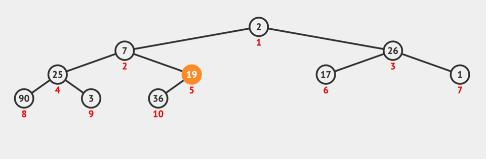

# 堆

<https://www.educative.io/blog/data-structure-heaps-guide>
<https://www.geeksforgeeks.org/building-heap-from-array/>
> 完全二叉树适用于数组存储法，而堆又是一个完全二叉树，所以它可以直接使用数组存储法存储，利用完全二叉树的结构来维护的一维数组
> 大顶堆：每个节点的值都大于或等于其左右孩子节点的值
> 小顶堆：每个节点的值都小于或等于其左右孩子节点的值

## 使用堆的原因

> 对于一个随时会有更新的序列，可以随时知道这个序列的最小值或最大值是什么。<br>
> 如果是线性结构，每次插入之后，假设原数组是有序的，那使用二分把它放在正确的位置也未尝不可，但是插入的时候从数组中留出空位就需要O(n)的时间复杂度，删除的时候亦然。

## 堆元素为什么是从下标 1 开始

> 完全二叉树使用数组存储法（下标从1开始），可以通过下标找到任意节点的父子节点。
> Math.floor() 返回小于或等于一个给定数字的最大整数。parseInt本意是进制转换，只是刚好parseInt(X, 10)达到相同目的，并非parseInt实际用途。

* 根在数组下标 0 处
* 第 i 个节点的父节点 parIdx = Math.floor((i-1)/2)
* 第 i 个节点的左子节点 cIdx = 2 * i + 1
* 第 i 个节点的右子节点 cIdx = 2 * i + 2

## 创建堆

### 原地创建（堆化）

> 时间复杂度：O(N)，优于插入堆化<br>


```javascript
const source = [2, 7, 26, 25, 19, 17, 1, 90, 3, 36]
// corrent: [90, 36, 17, 25, 26, 7, 1, 2, 3, 19]
function heapSort (arr) {
  let cIdx = arr.length - 1
  /* 最外层循环，遍历所有二叉树的父节点 */
  for (let parIdx = parseInt((cIdx - 1)/2); parIdx >= 0; cIdx--) {

  }
}
function shiftDown (cArr, ) {

}
```

### 插入式创建

> 时间复杂度：O(NlogN)<br>
> 堆满单个节点的时间复杂度为O（log N），其中N是节点总数。因此，构建整个堆将进行N次堆操作，并且总时间复杂度将为O（N * logN）。

* 将节点插入到队尾
* 自下往上堆化： <font color=red>将插入节点与其父节点比较</font>，如果插入节点大于父节点（大顶堆）或插入节点小于父节点（小顶堆），则插入节点与父节点调整位置
* 一直重复上一步，直到<font color=red>不需要交换或交换到根节点</font>，此时插入完成。


```javascript
const source = [2, 7, 26, 25, 19, 17, 1, 90, 3, 36]
// corrent: [90, 36, 17, 25, 26, 7, 1, 2, 3, 19]
const result = []
for (let num of source) {
  insert(num)
}
function insert (number) {
  /* 1、把节点插入队尾 */
  result.push(number)
  /* 
  * 2、插入节点与其父节点比较，比父节点大则交换节点
  * 3、不断往上与父节点比较，直到比父节点小
  */
  let insInx = result.length - 1
  let parIdx
  while (insInx > 0) {
    parIdx = parseInt((insInx - 1)/2)
    if (parIdx >= 0 && result[insInx] > result[parIdx]) {
      [result[insInx], result[parIdx]] = [result[parIdx], result[insInx]]
      insInx = parIdx
    } else {
      // 当父节点比子节点大，往上不用继续比较，肯定父节点都比当前节点大，跳出循环
      break
    }
  }
}
console.log(result)
```

### 最大堆

```javascript
class maxHeap {
  constructor() {
      this.heap = []
      this.elements = 0  // 记录当前堆中元素个数，不用频繁this.heap.length
  }

  insert(val) {
    if(!val) return

    this.elements = this.elements + 1
    if (this.elements >= this.heap.length) {
      this.heap.push(val)
      this.__percolateUp(this.heap.length - 1)
    } else {
      this.heap[this.elements] = val
      this.__percolateUp(this.elements - 1)
    }
  }
  /*
  * getMax()，在不修改堆的情况下返回堆（根节点）中的最大值。
  * 时间复杂度：O(1)
  */
  getMax() {
    if (this.elements !== 0)
      return this.heap[0]
    return null
  }
  /*
  * removeMax()，返回并删除堆中的最大值，类似pop()
  * 时间复杂度：O(logN)
  * 1、移除根节点
  * 2、将最底层的最后一个节点移到root位置
  * 3、比较父子节点，如果父节点小于子节点，交换元素，向下重复进行
  * 4、直到父节点大于子节点或者到达叶子节点
  */
  removeMax() {
    /* 获取根节点，便于后续移除 */
    let max = this.heap[0]
    if (this.elements > 1) {
      /* 将最底层的最后一个节点移到root位置 */
      this.heap[0] = this.heap[this.elements - 1]
      this.elements = this.elements - 1
      /* 堆化 */
      this.__maxHeapify(0)
      return max
    } else if (this.elements === 1) {
      // 表示当前堆只有一个元素，直接推出根节点
      this.elements = this.elements - 1
      return max
    } else {
      // 表示当前堆为空
      return null
    }
  }
  /* 
  * percolate 渗入、过滤
  * percolateUp 自下而上
  * percolateDown 自上而下
  */
  /* 
  * __percolateUp 不断向上与父节点比较，直到当前节点为根节点或者父节点比当前节点大时结束该过程
  * 时间复杂度：O(logN)
  */
  __percolateUp(index) {
    const parent = Math.floor((index - 1) / 2)
    if (index <= 0)
      // 当前为根节点，结束
      return
    else if (this.heap[parent] < this.heap[index]) {
      // 当前节点比父节点大，交换节点，继续向上比较
      [this.heap[parent], this.heap[index]] = [this.heap[index], this.heap[parent]]
      this.__percolateUp(parent)
    }
    // 当前节点比父节点小，结束
  }
  /*
  * __maxHeapify 
  * 时间复杂度：O(1)
  */
  __maxHeapify(index) {
    let left = (index * 2) + 1
    let right = (index * 2) + 2
    let largest = index
    /*
    * 通过与左右俩个子节点对比，得知三个节点中最大值的下标
    * 如果最大值下标不是父节点本身的下标，则交换节点
    * 重复操作，向下对比，直到最大值的下标还是父节点本身
    */
    if ((this.elements > left) && (this.heap[largest] < this.heap[left])) {
      largest = left
    } else if ((this.elements > right) && (this.heap[largest] < this.heap[right])) {
      largest = right
    } else if (largest !== index) {
      const tmp = this.heap[largest]
      this.heap[largest] = this.heap[index]
      this.heap[index] = tmp
      this.__maxHeapify(largest)
    }
  }

  /* 
  * 对应插入式创建堆
  * 时间复杂度：O(NlogN)
  */
  buildHeapByInsert(arr) {
    if(!arr) return
    
    for (let i = arr.length - 1; i >= 0; i--) {
      this.insert(arr[i])
    }
  }

  /* 
  * 对应原地创建堆 
  * 时间复杂度：O(N)
  */
  buildHeap(arr) {
    if(!arr) return

    this.heap = arr
    this.elements = this.heap.length
    for (let i = this.heap.length - 1; i >= 0; i--) {
      this.__maxHeapify(i)
    }
  }
  /*
  * 优化后的原地创建堆
  * 时间复杂度：O(N)，证明过程详见：http://www.cs.umd.edu/~meesh/351/mount/lectures/lect14-heapsort-analysis-part.pdf
  * 因为：1、叶子节点不需要被优化因为它们在父节点堆化过程中已满足堆特性。
  *      2、完整二叉树的数组表示形式能够体现二叉树按层级顺序遍历，换句话说：“下标 0 到最后一个非叶子节点索引这个范围内的节点都是非叶子节点”
  * 优化方法：找到最后一个非叶子节点的位置，从最后一个非叶子节点往上遍历直到根节点，对每个非叶子节点进行堆化。
  * 有n个元素，最后一个非叶子节点的索引 = Math.floor(((n-1) - 1)/2)
  */ 
  buildHeapOptimize(arr) {
    if(!arr) return

    this.heap = arr
    this.elements = this.heap.length
    let lastIdx = Math.floor((this.elements-1-1)/2)
    for (let i = lastIdx; i >= 0; i--) {
      this.__maxHeapify(i)
    }
  }
}
let heap = new maxHeap()
```

### 最小堆

```javascript
class minHeap {
  constructor() {
    this.heap = []
    this.elements = 0
  }

  insert(val) {
    if (this.elements >== this.heap.length) {
      this.elements = this.elements + 1
      this.heap.push(val)
      this.__percolateUp(this.heap.length - 1)
    } else {
      this.heap[this.elements] = val
      this.elements = this.elements + 1
      this.__percolateUp(this.elements - 1)
    }
  }
  
  getMin() {
    if (this.heap.length !== 0)
        return this.heap[0]
    return null
  }

  removeMin() {
    const min = this.heap[0]
    if (this.elements > 1) {            
      this.heap[0] = this.heap[this.elements - 1]
      this.elements = this.elements - 1
      this.__minHeapify(0)
      return min
    } else if (this.elements == 1) {
      this.elements = this.elements - 1
      return min
    } else {
      return null
    }
  }

  __percolateUp(index) {
    let parent = Math.floor((index - 1) / 2)
    if (index <= 0)
      return
    else if (this.heap[parent] > this.heap[index]) {
      let tmp = this.heap[parent]
      this.heap[parent] = this.heap[index]
      this.heap[index] = tmp
      this.__percolateUp(parent)
    }
  }

  __minHeapify(index) {
    let left = (index * 2) + 1
    let right = (index * 2) + 2
    let smallest = index
    if ((this.elements > left) && (this.heap[smallest] > this.heap[left])) {
      smallest = left
    }
    if ((this.elements > right) && (this.heap[smallest] > this.heap[right]))
      smallest = right
    if (smallest !== index) {
      let tmp = this.heap[smallest]
      this.heap[smallest] = this.heap[index]
      this.heap[index] = tmp
      this.__minHeapify(smallest)
    }
  }

  buildHeap(arr) {
    this.heap = arr
    this.elements = this.heap.length
    for (let i = this.heap.length - 1; i >= 0; i--) {
      this.__minHeapify(i)
    }
  }
}

let heap = new minHeap()
heap.insert(12)
heap.insert(10)
heap.insert(-10)
heap.insert(100)

console.log(heap.getMin()) //you should get -10

let newheap = new minHeap()
let arr = [12, 6, 8, 3, 16, 4, 27]
newheap.buildHeap(arr) //builds this new heap with elements from the array
console.log(newheap.getMin()) //this logs 3

newheap.removeMin()

console.log(newheap.getMin())
```

### 最大堆转换成最小堆

> 时间复杂度：O(N)

```JavaScript
function minHeapify(heap, index) {
  var left = index * 2
  var right = (index * 2) + 1
  var smallest = index

  if ((heap.length > left) && (heap[smallest] > heap[left])) {
      smallest = left
  }
  if ((heap.length > right) && (heap[smallest] > heap[right]))
      smallest = right
  if (smallest != index) {
      var tmp = heap[smallest]
      heap[smallest] = heap[index]
      heap[index] = tmp
      minHeapify(heap, smallest)
  }
  return heap
}

function convertMax(maxHeap) {
  for (var i = Math.floor((maxHeap.length) / 2); i > -1; i--)
      maxHeap = minHeapify(maxHeap, i)
  return maxHeap
}

var maxHeap = [9,4,7,1,-2,6,5]
console.log(convertMax(maxHeap))
```
