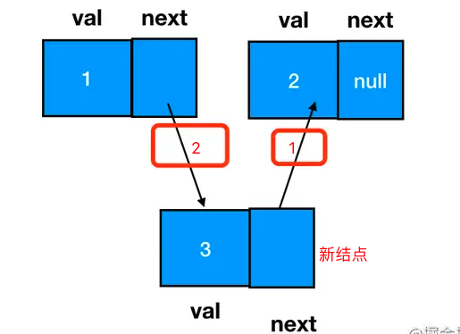
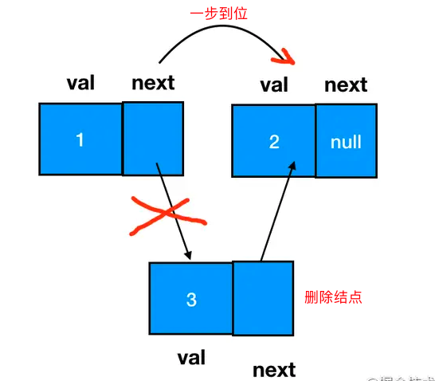
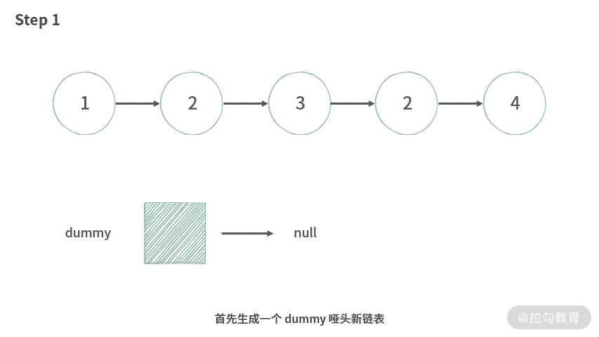
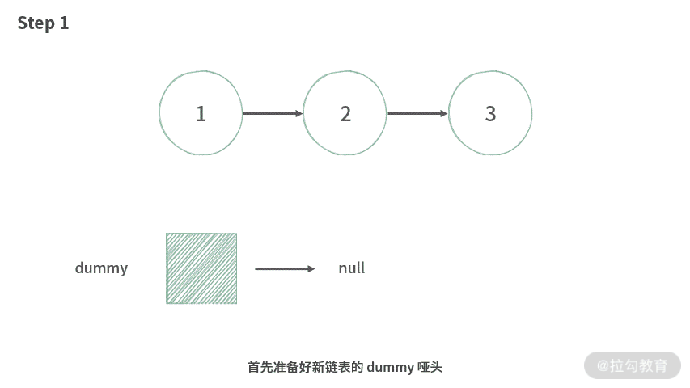

# 链表

> 在前一个元素已知的情况下，灵活分配空间，在O(1)时间内增加、删除
> 查询元素需要O(N)时间

## 添加元素

### 尾部添加元素

直接修改尾部元素的next指向新元素即可

### 任意结点间插入新结点


**在操作时，只要知道node1的信息即可（node1.next能够获取Node2信息）**

```js
const node3 = new ListNode(3)
node3.next = node1.next
node1.next = node3
```

## 删除元素


**定位目标结点的前驱结点(node1)。**
**直接让它的前驱结点 node1 的 next 指针跳过它、指向 node3 的后继即可**
node3 就成为了一个完全不可抵达的结点了，它会被 JS 的垃圾回收器自动回收掉

```js
node1.next = node3.next 
```

## 基操勿6

```javascript
/*
* 链表结点
*/
class ListNode {
  constructor(val){
    this.value = null
    this.next = null
  }
}
/*
* 实现单链表
*/
class LinkedList {
  constructor(){
    // 虚拟结点，初始化好以后，不会移动
    this.dummy = new ListNode()
    /* 每次对链表进行操作后，记得修改tail指针和length */
    // 尾结点，始终指向最后一个结点
    this.tail = dummy
    // 链表长度
    this.length = 0
  }
  /*
  * 大多数情况下，返回指定结点前面的一个结点 prev 更加有用。
  * 1、通过 prev.next 就可以访问到你想要找到的结点，如果没有找到，那么 prev.next 为 null；
  * 2、通过 prev 可以方便完成新增结点/删除结点操作：在 target 前面 insert 一个新结点，或者将 target 结点从链表中移出去。
  * 返回 index 结点的前驱结点，
  */
  __getPrevNode(index) {
    // 一前一后
    let prev = this.dummy
    let post = this.dummy.next
    // 初始化时 post 位于 下标0 ，移动 index 次到达 下标index 位置
    for(let i = 0; post && i < index; i++){
      prev = post
      post = post.next
    }
    return prev
  }

  addAtTail(val) {
    /* 将值为 val 的结点追加到链表尾部*/
    // 通过虚拟结点初始化单链表后，tail始终有值，不用做非空判断
    this.tail.next = new ListNode(val)
    this.tail = this.tail.next
    this.length++
  }

  addAtHead(val) {
    /* 插入值val的新结点，使它成为链表的第一个结点*/
    const head = new ListNode(val)
    head.next = this.dummy.next
    this.dummy.next = head
    if(this.dummy === this.tail){
      // 此时为空链表，添加的结点为唯一结点，需要修改tail指针；
      // 非空链表时，添加头结点不会影响tail的指针，无需修正；
      this.tail = head
    }
    this.length++
  }
  
  get(index) {
    /* 获取链表中第index个结点的值。如果索引无效，则返回-1。*/
    // index从0开始。
    if (index < 0 || index > this.length - 1) return -1
    // this.__getPrevNode(index).next 必定有值
    return this.__getPrevNode(index).next.value
  }

  addAtIndex(index, val) {
    /* 在链表中的第 index 个结点之前添加值为 value  的结点。*/
    // 1. 如果 index 等于链表的长度，则该结点将附加到链表的末尾。
    // 2. 如果 index 大于链表长度，则不会插入结点。
    // 3. 如果index小于0，则在头
    // 4. 否则在指定位置前面插入结点。
    if (index === this.length) {
      this.addAtTail(val)
    } else if (index < 0) {
      this.addAtHead(val)
    } else if (index >= 0 && index <= this.length - 1) {
      /* 添加到指定位置 */
      const prev = this.__getPrevNode(index)
      const insertNode = new ListNode(index)
      insertNode.next = prev.next
      prev.next = insertNode
      this.length++
    }
  }

  deleteAtIndex(index) {
    /* 如果索引index有效，则删除链表中的第index个结点。*/
    if (index < 0 || index > this.length -1) return
    const prev = this.__getPrevNode(index)
    /* 如果删除的是最后一个结点，修复tail指针；否则删除的是dummy到tail之间的结点，必定有值，不用非空判断 */
    if (this.tail === prev.next) {
      this.tail = prev
    }
    prev.next = prev.next.next
    this.length--
  }
}
```

## 解题技巧

### 构建一个虚拟的链表头

* 俩个排序的链表，进行整合排序，将链表奇偶数按原定顺序分离，生成前半段为奇数，后半部分为偶数的链表

### 新链表

#### 删除指定值的结点，在尾部根据条件插入结点

* 删除指定值的结点


```javascript
/*
* 时间复杂度：O(N)
* 空间复杂度：O(1)
*/
function removeElements (head, val) {
  const dummy = new ListNode()
  let tail = dummy
  let cur= head
  while (cur) {
    if (cur.val === val) {
      cur = cur.next
      continue
    }
    tail.next = cur
    tail = tail.next
  }
  tail.next = null
  return dummy.next
}
```

* 给定一个排序链表，删除重复出现的元素，使得每个元素只出现一次
* 给定一个排序链表，删除重复出现的元素，只留下没有重复出现的元素。

#### 链表反转，始终在头部插入遍历结点



```javascript
/* 
* 时间复杂度：O(N)
* 空间复杂度：O(1)
*/
function reverseList (head) {
  const dummy = new ListNode()
  // 从头遍历 head 链表
  while (head) {
    /*  
    * 1、取得下一结点，用于下次遍历
    * 2、当前结点指向 dummy.next 结点
    * 3、插入结点到新链表头部
    * 4、更新旧链表的头结点
    */
    const temp = head.next
    head.next = dummy.next
    dummy.next = head
    head = temp
  }
  return dummy.next
}
```

#### 合并有序链表，尾部插入法

```javascript
/* 
* 时间复杂度：O(N)
* 空间复杂度：O(1)
*/
var mergeTwoLists = function(l1, l2) {
  const dummy = new ListNode()
  let tail = dummy
  while (l1 || l2) {
    if (!l2 || (l1 && l1.val < l2.val)) {
      /*
      * l2 为空
      * l1 和 l2 不为空且 l1 值小于 l2 值
      */
      tail.next = l1
      tail = tail.next
      l1 = l1.next
    } else {
      /*
      * l1 为空
      * l1 和 l2 不为空且 l2 值小于 l1 值
      */
     tail.next = l2
     tail = tail.next
     l2 = l2.next
    }
  }
  // 最后修复尾结点
  tail.next = null
  return dummy.next
}
```

#### k个有序链表合并

```javascript
/* 
* 时间复杂度：O(N*k)
* 空间复杂度：O(1)
*/
var mergeKLists = function(lists) {
  /* 
  * k 个链表合并问题，简化为多次俩个链表合并
  */
  return lists.reduce((mergeNode, curNode) => {
    const dummy = new ListNode()
    let tail = dummy
    while (mergeNode || curNode) {
      if (!curNode || (mergeNode && mergeNode.val < curNode.val)) {
        tail.next = mergeNode
        mergeNode = mergeNode.next
      } else {
        tail.next = curNode
        curNode = curNode.next
      }
      tail = tail.next
    }
    tail.next = null
    return dummy.next
  }, null)
}
```

## 双指针

### 快慢指针

#### 证明闭环形链表

> 按照相对论的观点，以慢指针pslow为参考系，或者说从慢指针pslow的视角来看，快指针pfast每次只是移动一步，当然也就不会产生跳过慢指针的情况。

#### 拆分链表

<https://kaiwu.lagou.com/course/courseInfo.htm?courseId=685#/detail/pc?id=6694>

### 间隔指针

#### 链表的倒数第 N 个结点

> 前面的指针先走 k 步，后面的指针再一起走。

* 在原链表前面加上 dummy，变成带假头的链表
* front 指针从 dummy 开始，走 k 步，然后停下来
* back 指针指向链表 dummy 假头
* 然后两个指针再一起走
* 当 front 指针指向最后一个结点时，back 指针刚好指向倒数第 k 个结点的前驱。

```javascript
/* 
* 时间复杂度：O(N)
* 空间复杂度：O(1)
*/
var removeNthFromEnd = function(head, n) {
  const dummy = new ListNode(0, head)
  let pre = dummy, front = dummy
  let length = 0
  while (front.next) {
    front = front.next
    length ++
    if (length > n) pre = pre.next
  }
  /* 
  * 1、结点数少于 k ，不处理
  * 2、结点数等于k，删除头结点
  * 3、结点数大于k，front 遍历到尾结点，pre指向第 n - 1 ，删除后继结点即可 
  */
  if (length >= n) {
    pre.next = pre.next.next
  }
  return dummy.next
}
```

## 题型

### 21，19，876

### k个一组翻转链表(25)
<!-- https://leetcode-cn.com/problems/reverse-nodes-in-k-group/solution/tu-jie-kge-yi-zu-fan-zhuan-lian-biao-by-user7208t/ -->
```javascript
/**
 * Definition for singly-linked list.
 * function ListNode(val, next) {
 *     this.val = (val===undefined ? 0 : val)
 *     this.next = (next===undefined ? null : next)
 * }
 */
/**
 * @param {ListNode} head
 * @param {number} k
 * @return {ListNode}
 */
var reverseKGroup = function(head, k) {
  const dummy = new ListNode(0, head)
  let prev = dummy
  let end = dummy
  while(end !== null ){
    for(let i = 0; i < k && end !== null; i ++) end = end.next
    if(end === null) break  /* 当前组别中节点不足k个时不做翻转 */

    let start = prev.next  /* 记录未翻转前的头节点 */
    let next = end.next
    end.next = null  /* 将尾节点的next与下一个组别的节点断开 */
    prev.next = reserveNode(start)  /* 翻转节点 */
    start.next = next  /* 翻转后的头节点变成了尾节点，连接下一组 */

    // 移动下一组的初始下标
    prev = start
    end = start
  }
  return dummy.next

  function reserveNode(head){
    let pre = null
    let curr = head
    while(curr !== null){
      let next = curr.next
      curr.next = pre
      pre = curr
      curr = next
    }
    return pre
  }
};
```

### （字节跳动）求单链表距最后一个节点的距离为k的节点

### 反转链表(206)

```javascript
// 时间复杂度O(n)
// 空间复杂度O(1)
var reverseList = function(head) {
    let curr = head
    let prev = null
    while (curr) {
        let currTemp = curr.next  // 保存下一个节点指向避免后续操作丢失
        curr.next = prev
        prev = curr
        curr = currTemp
    }
    return prev
}
```

### （字节跳动）判断一个单向链表是否有环。(141)

```javascript
// 时间复杂度O(n)
// 空间复杂度O(1)
var hasCycle = function(head) {
    let fast,slow
    if(head&&head.next){
        fast = head.next
        slow = head
    }else{
        return false
    }
    while(1){
        if(!fast||!fast.next){
            return false
        }else if(fast === slow || fast.next === slow){
            return true
        }else{
            fast = fast.next.next
            slow = slow.next
        }
    }
}
```

### 俩俩交换链表节点

### （字节跳动）已知两个单向链表某个节点相同，现在给出两个链表的头节点，请找出两个链表相同的节点

### （字节跳动）有一个单向链表，奇数位升序，偶数位降序，请将它转换为一个整体升序的单向链表

### （字节跳动）给定单链表，奇数位升序，偶数位降序，现要求输出全局升序，不用数组
